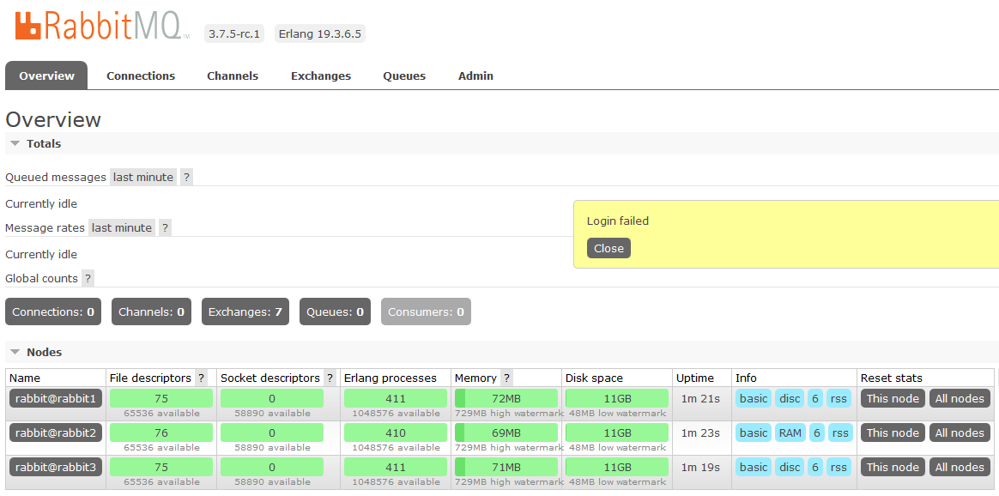

# 前言：

在 中，已经介绍了rbtmq的单机版和集群版安装，步骤非常的繁琐，在这里介绍在docker中搭建rabtmq

# 1.Dockerfile搭建镜像

## 1.1新建image文件夹，里面包含以下文件


## 1.2Dockerfile
```
#基础镜像
FROM centos:7

#定义时区参数
ENV TZ=Asia/Shanghai

#设置时区
RUN ln -snf /usr/share/zoneinfo/$TZ /etc/localtime && echo '$TZ' > /etc/timezone

#设置编码为中文
RUN yum -y install kde-l10n-Chinese glibc-common

RUN localedef -c -f UTF-8 -i zh_CN zh_CN.utf8

ENV LC_ALL zh_CN.utf8 

#安装wget工具
RUN yum install -y wget unzip tar

#安装erlang
RUN rpm -Uvh https://github.com/rabbitmq/erlang-rpm/releases/download/v19.3.6.5/erlang-19.3.6.5-1.el7.centos.x86_64.rpm

RUN yum install -y erlang

#安装rabbitmq
RUN rpm --import http://www.rabbitmq.com/rabbitmq-signing-key-public.asc

RUN yum install -y https://github.com/rabbitmq/rabbitmq-server/releases/download/v3.7.5-rc.1/rabbitmq-server-3.7.5.rc.1-1.el7.noarch.rpm

RUN /usr/sbin/rabbitmq-plugins list <<<'y'

#安装常用插件
RUN /usr/sbin/rabbitmq-plugins enable --offline rabbitmq_mqtt rabbitmq_stomp rabbitmq_management  rabbitmq_management_agent rabbitmq_federation rabbitmq_federation_management <<<'y'

#添加配置文件
ADD rabbitmq.config /etc/rabbitmq/

#添加cookie，使集群环境中的机器保持互通
ADD erlang.cookie /var/lib/rabbitmq/.erlang.cookie

#添加启动容器时执行的脚本，主要根据启动时的入参做集群设置
ADD startrabbit.sh /opt/rabbit/

#给相关资源赋予权限
RUN chmod u+rw /etc/rabbitmq/rabbitmq.config \
&& chown rabbitmq:rabbitmq /var/lib/rabbitmq/.erlang.cookie \
&& chmod 400 /var/lib/rabbitmq/.erlang.cookie \
&& mkdir -p /opt/rabbit \
&& chmod a+x /opt/rabbit/startrabbit.sh

#暴露常用端口
EXPOSE 5672
EXPOSE 15672
EXPOSE 25672
EXPOSE 4369
EXPOSE 9100
EXPOSE 9101
EXPOSE 9102
EXPOSE 9103
EXPOSE 9104
EXPOSE 9105

#设置容器创建时执行的脚本
ENTRYPOINT ["/opt/rabbit/startrabbit.sh"]
```
## 1.3erlang.cookie
```
ERLANGCOOKIE
```
## 1.4rabbitmq.config
```
[{rabbit, [{loopback_users, []}]}].
```
## 1.5startrabbit.sh
* 如果docker-compose.yml指定了环境变量RABBITMQ_DEFAULT_USER和RABBITMQ_DEFAULT_PASS，就会设置新的用户名和密码，没有指定使用默认的guest和user账户
* 如果docker-compose.yml没有指定环境变量CLUSTERED，那么就是一个单机版
* 如果docker-compose.yml指定环境变量CLUSTERED：
   - 没有指定CLUSTER_WITH，单机版
   - 指定了CLUSTER_WITH 
      - 指定了RAM_NODE，当前的HOSTNAME以内存节点加入集群节点
      - 没指定RAM_NODE，当前的HOSTNAME以磁盘节点加入集群节点
   - 指定了HA_ENABLE，以Haproxy高可用的方式管理集群，主挂从上
```
#!/bin/bash
change_default_user() {

        if [ -z $RABBITMQ_DEFAULT_USER ] && [ -z $RABBITMQ_DEFAULT_PASS ]; then
                echo "Maintaining default 'guest' user"
        else 
                echo "Removing 'guest' user and adding ${RABBITMQ_DEFAULT_USER}"
                rabbitmqctl delete_user guest
                rabbitmqctl add_user $RABBITMQ_DEFAULT_USER $RABBITMQ_DEFAULT_PASS
                rabbitmqctl set_user_tags $RABBITMQ_DEFAULT_USER administrator
                rabbitmqctl set_permissions -p / $RABBITMQ_DEFAULT_USER ".*" ".*" ".*"
        fi
}

HOSTNAME=`env hostname`

if [ -z "$CLUSTERED" ]; then
        # if not clustered then start it normally as if it is a single server
        /usr/sbin/rabbitmq-server &
        rabbitmqctl wait /var/lib/rabbitmq/mnesia/rabbit\@$HOSTNAME.pid
        change_default_user
        tail -f /var/log/rabbitmq/rabbit\@$HOSTNAME.log
else
        if [ -z "$CLUSTER_WITH" ]; then
                # If clustered, but cluster with is not specified then again start normally, could be the first server in the
                # cluster
                /usr/sbin/rabbitmq-server&
                rabbitmqctl wait /var/lib/rabbitmq/mnesia/rabbit\@$HOSTNAME.pid
                tail -f /var/log/rabbitmq/rabbit\@$HOSTNAME.log
        else
                /usr/sbin/rabbitmq-server &
                rabbitmqctl wait /var/lib/rabbitmq/mnesia/rabbit\@$HOSTNAME.pid
                rabbitmqctl stop_app
                if [ -z "$RAM_NODE" ]; then
                        rabbitmqctl join_cluster rabbit@$CLUSTER_WITH
                else
                        rabbitmqctl join_cluster --ram rabbit@$CLUSTER_WITH
                fi

                rabbitmqctl start_app

                # If set ha flag, enable here
                if [ -z "$HA_ENABLE" ]; then
                        echo "Running with normal cluster mode"
                else
                        rabbitmqctl set_policy HA '^(?!amq\.).*' '{"ha-mode": "all"}'
                        echo "Running wiht HA cluster mode"
                fi

                # Tail to keep the a foreground process active..
                tail -f /var/log/rabbitmq/rabbit\@$HOSTNAME.log
        fi
fi
```
## 1.6运行Dockerfile,生成镜像
```
docker build -t rabbitmq-docker:3.7.5 .
```
# 2.使用docker-compose.yml运行容器
## 2.1docker-compose.yml编写
```
version: '3'
services:
  rabbit1:
    image: rabbitmq-docker:3.7.5
    hostname: rabbit1
    ports:
      - "15672:15672"
    environment:
      - RABBITMQ_DEFAULT_USER=admin
      - RABBITMQ_DEFAULT_PASS=888888
  rabbit2:
    image: image: rabbitmq-docker:3.7.5
    hostname: rabbit2
    depends_on:
      - rabbit1
    links:
      - rabbit1
    environment:
     - CLUSTERED=true
     - CLUSTER_WITH=rabbit1
     - RAM_NODE=true
    ports:
      - "15673:15672"
  rabbit3:
    image: image: rabbitmq-docker:3.7.5
    hostname: rabbit3
    depends_on:
      - rabbit2
    links:
      - rabbit1
      - rabbit2
    environment:
      - CLUSTERED=true
      - CLUSTER_WITH=rabbit1
    ports:
      - "15675:15672"
```
## 2.2运行容器并打开网页
```
 docker-compose up -d
```

