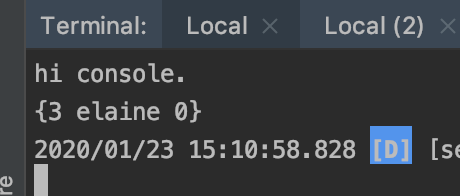

# 接入mysql-使用orm

## 说明 

本练习接上一章，[接入mysql-直接用SQL取数](./mysql.md)本节将使用orm读取数据库数据。


## 详细说明


* 安装依赖包 

```bash 
go get github.com/astaxie/beego/orm
```


* 新建一个模型文件``models/testorm.go``  

```go 
package models

import (
	"fmt"

	"github.com/astaxie/beego/orm"
	_"github.com/go-sql-driver/mysql"
)

type User struct {
	Id int
	Name string
	Sex int8
}

func init()  {
	orm.RegisterDataBase("default","mysql",
		"root:123456@tcp(127.0.0.1:3306)/db1?charset=utf8",30)
	orm.RegisterModel(new(User))
}

func PrintUserByORM()  {
	o := orm.NewOrm()
	user := User{Id: 3}
	o.Read(&user)
	fmt.Println(user)
}
```

* 在控制类中使用``controllers/default.go``  

```go 
package models

import (
	"fmt"

	"github.com/astaxie/beego/orm"
	_"github.com/go-sql-driver/mysql"
)

type User struct {
	Id int
	Name string
	Sex int8
}

func init()  {
	orm.RegisterDataBase("default","mysql",
		"root:123456@tcp(127.0.0.1:3306)/db1?charset=utf8",30)
	orm.RegisterModel(new(User))
}

func PrintUserByORM()  {
	o := orm.NewOrm()
	user := User{Id: 3}
	o.Read(&user)
	fmt.Println(user)
}

```

* 在控制类中使用``controllers/default.go``  

```go 
func (c * MainController) Hi(){
	fmt.Println("hi console.")

	//models.PrintUsers()
	models.PrintUserByORM()
	//指定对应的前端视图
	c.TplName = "index.tpl"
}
```


## 验证

* 启动执行该程序，访问页面``http://localhost:8080/hi``

```bash 
bee run 
```



