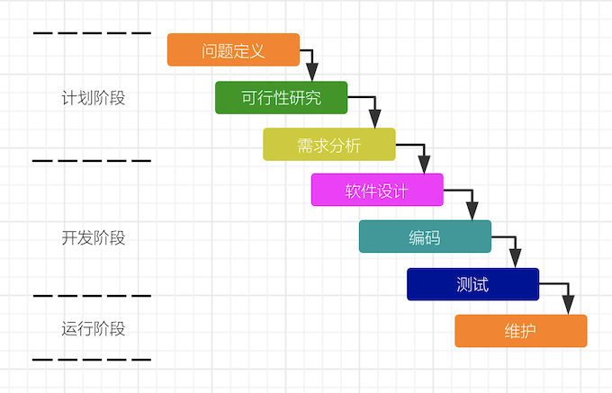
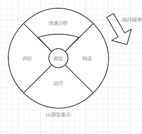
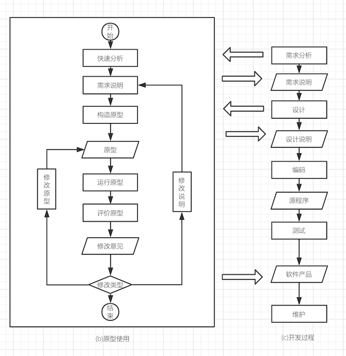
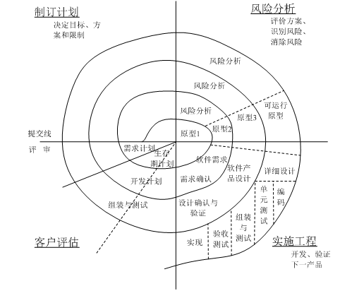
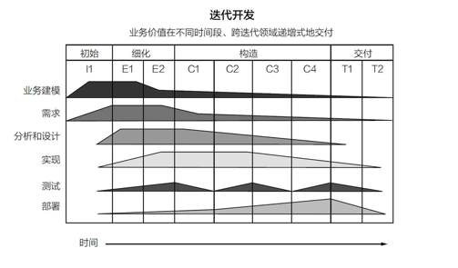
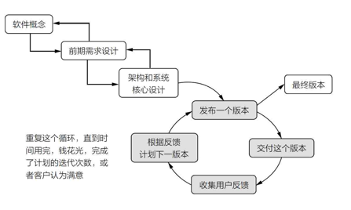

# 常见项目流程

* 瀑布模型
* "V"模式开发模型
* 快速原型模型
* 螺旋模型
* 迭代模型
* 敏捷开发模式

## 瀑布开发模型 

  

* 模型说明:

瀑布模型是将软件生存周期的各项活动规定为按固定顺序而连接的若干阶段工作，形如瀑布流水，最终得到软件产品。
1970年温斯顿·罗伊斯（Winston Royce）提出了著名的“瀑布模型”，直到80年代早期，它一直是唯一被广泛采用的软件开发模型。
核心思想：瀑布模型核心思想是按工序将问题化简，将功能的实现与设计分开，便于分工协作，即采用结构化的分析与设计方法将逻辑实现与物理实现分开。将软件生命周期划分为制定计划、需求分析、软件设计、程序编写、软件测试和运行维护等六个基本活动，并且规定了它们自上而下、相互衔接的固定次序，如同瀑布流水，逐级下落。

重要地位：它提供了软件开发的基本框架。其过程是从上一项活动接收该项活动的工作对象作为输入，利用这一输入实施该项活动应完成的内容给出该项活动的工作成果，并作为输出传给下一项活动。同时评审该项活动的实施，若确认，则继续下一项活动；否则返回前面，甚至更前面的活动。对于经常变化的项目而言，瀑布模型毫无价值。

 
* 模型优点:
  1. 为项目提供了按阶段划分的检查点。
  2. 当前一阶段完成后，您只需要去关注后续阶段。
  3. 可在迭代模型中应用瀑布模型。
  4. 它提供了一个模板，这个模板使得分析、设计、编码、测试和支持的方法可以在该模板下有一个共同的指导。
 
* 模型缺点:
  1. 各个阶段的划分完全固定，阶段之间产生大量的文档，极大地增加了工作量。
  2. 由于开发模型是线性的，用户只有等到整个过程的末期才能见到开发成果，从而增加了开发风险。
  3. 通过过多的强制完成日期和里程碑来跟踪各个项目阶段。
  4. 瀑布模型的突出缺点是不适应用户需求的变化。

## "V"模式开发模型

  

* 模型说明：
  以“编码”为黄金分割线，将整个过程分为开发和测试，并且开发和测试之间是串行的关系，样子像一个V字母，所以叫V形模型

* 优点：  
  1. 包含了底层测试（单元测试）和高层测试（系统测试）；
  1. 清楚的标识了开发和测试的各个阶段；
  1. 自上而下逐步求精，每个阶段分工明确，便于整体项目的把控。

* 缺点：
  1. 自上而下的顺序导致了，测试工作在编码之后，就导致错误不能及时的进行修改；
  1. 实际工作中，需求经常变化，导致v模型步骤，反复执行，返工量很大，灵活度较低。
　改良：每个步骤都可以进行小的迭代工作。

## 快速原型模型

* 模型说明：  

快速原型模型需要迅速建造一个可以运行的软件原型 ，以便理解和澄清问题，使开发人员与用户达成共识，最终在确定的客户需求基础上开发客户满意的软件产品。 快速原型模型允许在需求分析阶段对软件的需求进行初步而非完全的分析和定义，快速设计开发出软件系统的原型，该原型向用户展示待开发软件的全部或部分功能和性能；用户对该原型进行测试评定，给出具体改进意见以丰富细化软件需求；开发人员据此对软件进行修改完善，直至用户满意认可之后，进行软件的完整实现及测试、维护。

   

 

* 优点：
  * 克服瀑布模型的缺点，减少由于软件需求不明确带来的开发风险。
  * 这种模型适合预先不能确切定义需求的软件系统的开发。
* 缺点：
  * 所选用的开发技术和工具不一定符合主流的发展；快速建立起来的系统结构加上连续的修改可能会导致产品质量低下。
  * 使用这个模型的前提是要有一个展示性的产品原型，因此在一定程度上可能会限制开发人员的创新。

## 螺旋模型

 

* 模型说明:

瀑布模型和快速原型模型结合起来，强调了其他模型所忽视的风险分析，特别适合于大型复杂的系统。

螺旋模型是一种演化软件开发过程模型，它兼顾了快速原型的迭代的特征以及瀑布模型的系统化与严格监控。螺旋模型最大的特点在于引入了其他模型不具备的风险分析，使软件在无法排除重大风险时有机会停止，以减小损失。同时，在每个迭代阶段构建原型是螺旋模型用以减小风险的途径。螺旋模型更适合大型的昂贵的系统级的软件应用。

螺旋模型采用一种周期性的方法来进行系统开发。这会导致开发出众多的中间版本。使用它，项目经理在早期就能够为客户实证某些概念。该模型是快速原型法，以进化的开发方式为中心，在每个项目阶段使用瀑布模型法。这种模型的每一个周期都包括需求定义、风险分析、工程实现和评审4个阶段，由这4个阶段进行迭代。软件开发过程每迭代一次，软件开发又前进一个层次。螺旋模型基本做法是在“瀑布模型”的每一个开发阶段前引入一个非常严格的风险识别、风险分析和风险控制，它把软件项目分解成一个个小项目。每个小项目都标识一个或多个主要风险，直到所有的主要风险因素都被确定。

螺旋模型基本做法是在“瀑布模型”的每一个开发阶段前引入一个非常严格的风险识别、风险分析和风险控制，它把软件项目分解成一个个小项目。每个小项目都标识一个或多个主要风险，直到所有的主要风险因素都被确定。
螺旋模型强调风险分析，使得开发人员和用户对每个演化层出现的风险有所了解，继而做出应有的反应，因此特别适用于庞大、复杂并具有高风险的系统。对于这些系统，风险是软件开发不可忽视且潜在的不利因素，它可能在不同程度上损害软件开发过程，影响软件产品的质量。减小软件风险的目标是在造成危害之前，及时对风险进行识别及分析，决定采取何种对策，进而消除或减少风险的损害。

* 模型优点:
  1. 设计上的灵活性,可以在项目的各个阶段进行变更
  2. 以小的分段来构建大型系统,使成本计算变得简单容易。
  3. 客户始终参与每个阶段的开发,保证了项目不偏离正确方向以及项目的可控性。
  4. 随着项目推进,客户始终掌握项目的最新信息 , 从而他或她能够和管理层有效地交互。
  5. 客户认可这种公司内部的开发方式带来的良好的沟通和高质量的产品。
 

* 模型缺点
  很难让用户确信这种演化方法的结果是可以控制的。建设周期长，而软件技术发展比较快，所以经常出现软件开发完毕后，和当前的技术水平有了较大的差距，无法满足当前用户需求。

## 迭代模型

* 模型说明:

早在20世纪50年代末期，软件领域中就出现了迭代模型。最早的迭代过程可能被描述为“分段模型（stagewise model）”。迭代模型是RUP推荐的周期模型。被定义为：迭代包括产生产品发布（稳定、可执行的产品版本）的全部开发活动和要使用该发布必需的所有其他外围元素。在某种程度上，开发迭代是一次完整地经过所有工作流程的过程：需求分析、设计、实施和测试工作流程。实质上，它类似小型的瀑布式项目。RUP认为，所有的阶段都可以细分为迭代。每一次的迭代都会产生一个可以发布的产品，这个产品是最终产品的一个子集。

 

* 模型优点:  
与传统的瀑布模型相比较，迭代过程具有以下优点：
  1. 降低了在一个增量上的开支风险。如果开发人员重复某个迭代，那么损失只是这一个开发有误的迭代的花费。
  2. 降低了产品无法按照既定进度进入市场的风险。通过在开发早期就确定风险，可以尽早来解决而不至于在开发后期匆匆忙忙。
  3. 加快了整个开发工作的进度。因为开发人员清楚问题的焦点所在，他们的工作会更有效率。
  4. 由于用户的需求并不能在一开始就作出完全的界定，它们通常是在后续阶段中不断细化的。因此，迭代过程这种模式使适应需求的变化会更容易些。
 
* 模型缺点:
在项目早期开发可能有所变化 ，对于开发人员的要求较高，需有一个高素质的项目管理者和一个高技术水平的开发团队

## 敏捷开发模式

  

* 模型说明:

敏捷模型以迭代模型为理论基础。

敏捷模型的概念比较广，包含：XP、Scrum、FDD、DSDM、Crystal、ASD等等开发方法。或者说，敏捷模型是这些轻量级软件开发方法的一个统称。

模型说明

敏捷开发模式是一种从1990年代开始逐渐引起广泛关注的一些新型软件开发方法，是一种应对快速变化的需求的一种软件开发能力。它们的具体名称、理念、过程、术语都不尽相同，相对于"非敏捷"，更强调程序员团队与业务专家之间的紧密协作、面对面的沟通（认为比书面的文档更有效）、频繁交付新的软件版本、紧凑而自我组织型的团队、能够很好地适应需求变化的代码编写和团队组织方法，也更注重做为软件开发中人的作用。
敏捷开发以用户的需求进化为核心，采用迭代、循序渐进的方法进行软件开发。在敏捷开发中，软件项目在构建初期被切分成多个子项目，各个子项目的成果都经过测试，具备可视、可集成和可运行使用的特征。换言之，就是把一个大项目分为多个相互联系，但也可独立运行的小项目，并分别完成，在此过程中软件一直处于可使用状态。

软件敏捷开发宣言中提出了以下12个原则：
  1. 持续、尽早交付有价值的软件以满足客户，是我们优先要做的首要任务。
  2. 拥抱需求变更，甚至是在开发的后期。敏捷过程利用变更为客户带来竞争优势。
  3. 频繁交付可执行的软件，从几周到几个月，交付时间越短越好。
  4. 在整个项目过程中，业务人员和开发人员必须每天在一起工作。
  5. 激发每个团队成员的积极性来打造项目。为他们提供所需的环境与支持，并且信任他们可以完成工作。
  6. 在一个开发团队内部最有效的传递信息的方式是面对面的交流。
  7. 可执行的软件是进度的首要检验对象。
  8. 敏捷过程倡导可持续发展。赞助商，开发人员和用户应该尽可能保持一致的步伐。
  9. 保持关注先进的技术与设计会增强敏捷性。
  10. 尽量用艺术化来简单阐述未完成的工作是很有必要的。
  11. 最好的架构，需求，和设计出自于自我组织管理的团队。
  12. 每隔一段时间，回顾反思如何让团队变得更高效，并相应地调整其行为。

* 模型优点
  1. 迭代快，开发周期短；
  2. 不再耗费大量的时间来写文档，而是人与人面对面交流，只写一些必要的文档；
  3. 分工详细，每天都输出成果，客户能够看得到，会信任项目团队；
  4. 沟通多，容易发现问题，同时能够激起团队的协作、奋斗；

 

* 模型缺点
  1. 人与人之间的信任是非常重要的环节，但是这个比较难完成，技术团队的成员可能技术能力差别大，同时也有互相竞争，又或者是项目团队的成员有所保留，不愿意这样的沟通；
  2. 团队在开发期间的任务多、压力大，需要时刻保持“兴奋”，一般很难做到。